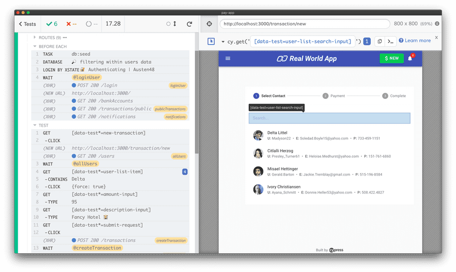

Automatização de testes web: configurando ambiente Cypress + Mochawesome

Há algumas fontes de pesquisa explicando como instalar o Cypress, dicas de como iniciar. Inclusive, a documentação da ferramenta é MUITO completa. Então, se você enroscou em algum ponto, pesquise na documentação!!!
=> O Cypress utiliza Javascript, e junto com ele algumas bibliotecas para nos ajudar na sintaxe dos testes (Mocha, Chai, Sinon, são alguns exemplos). Inclusive, você precisa ter o Node instalado na máquina para conseguir rodar a automatização.
Podemos rodar o Cypress em modo ‘headless’ (sem abrir visualmente o navegador) ou abrindo o módulo para desktop (imagem abaixo).
Também escreverei um pouco sobre os relatórios que podemos gerar dos testes que vamos rodar em outro post.

Fonte: cypress.io

Passo a passo inicial:
1. Se você já tem um documento com o arquivo ‘package.json’, pode pular esse passo. Caso você esteja começando um teste do zero, inicie o projeto. Eu utilizo NPM/Node + Windows nos meus projetos. Entre na pasta onde deseja armazenar os testes e, na linha de comando do terminal, digite:
>> npm init
Esse comando criará o ‘package.json’.

2. No mesmo terminal, instale o Cypress globalmente como dependência de desenvolvimento (quando — e se — o código for para produção, ela não será considerada):
>> npm --save-dev cypress

3. Você também precisará instalar o módulo do Cypress para desktop para usufruir do selector playground (vai facilitar muito a localização dos elementos!!!!):
Link para download: https://download.cypress.io/desktop

4. Para rodar o Cypress, você pode utilizar o comando abaixo no terminal:
>> npx cypress open
Esse comando, rodado pela primeira vez, montará a estrutura característica de pastas do Cypress, inclusive adicionando algumas specs de teste. Caso não vá usar, delete do projeto ou adicione ao arquivo gitignore.
Eu, particularmente, gosto de padronizar os comandos via ‘scripts’ dentro do ‘package.json’ (colocarei meu exemplo mais abaixo).

5. Para gerar relatórios, utilizo o mochawesome, que é um dos recomendados aqui na documentação do Cypress. Ao rodar o comando do mochawesome, além da possibilidade de gravarmos vídeos da execução em mp4, serão criados vários arquivos JSON (um para cada caso de teste). Para uni-los, utilizo o mochawesome-merge, que criará um arquivo output.json. Mas, para torná-lo mais fácil de visualizar, instalo o mochawesome-report-generator que transforma o .json em um arquivo .html (sim, configurado tipo uma página da internet!).
Então, digite no terminal:
>> npm install --save-dev mochawesome mochawesome-merge mochawesome-report-generator

E aí você me pergunta: Ah, mas é só isso??
E eu te respondo: não!
Para facilitar a sua vida, vou passar as configurações que utilizo para TODOS os projetos…
(Atenção! Esses não são os arquivos completos, é apenas a parte que referência os comandos e instalações feitas acima!)

Configuração final de uma pasta contendo Cypress

cypress.json

package.json

Explicando linha a linha do ‘package.json’:
Obs: o nome do comando (a parte antes dos dois pontos) pode ser personalizada por você.
>> "cy:open": "cypress open"
Ao comandar ‘npm run cy:open’ no terminal você abre o módulo desktop do Cypress para rodar suas specs de teste.

>> "cy:run": "cypress run"
Ao comandar ‘npm run cy:run’ no terminal você roda as specs de teste no formato ‘headless’, sem abrir o módulo desktop — geralmente utilizando o navegador Electron, gravando as execuções em ‘cypress/videos/…’ .

>> "report:cleanup": "rm -fr cypress/report/"
e
>> "video:cleanup": "rm -fr cypress/videos/"
Ao comandar ‘npm run report:cleanup’ e ‘npm run video:cleanup’ no terminal você limpa o conteúdo da pasta ‘cypress/report/…’ e da ‘cypress/videos/…’ . Normalmente rodo esse comando quando preciso rodar os testes novamente e não quero me confundir com os relatórios/vídeos gerados anteriormente.

>> "test:e2e": "cypress run --headless --browser chrome --no-exit"
Ao comandar ‘npm run test:e2e’ no terminal você roda todos os testes no Chrome, sem abrir visualmente o navegador e sem fechá-lo a cada mudança de arquivo de teste. Gerará os relatórios em .json separado por arquivos de teste, na pasta ‘cypress/report/mochawesome-report’

>> "report:merge": "mochawesome-merge cypress/report/mochawesome-report/*.json > cypress/report/output.json"
Ao comandar ‘npm run report:merge’ no terminal você unifica todos os testes .json em ‘cypress/report/output.json’.

>> "report:generate": "marge cypress/report/output.json --reportDir ./ --inline"
Ao comandar ‘npm run report:generate’ no terminal você transforma o output.json em output.html (‘cypress/report/output.html’)