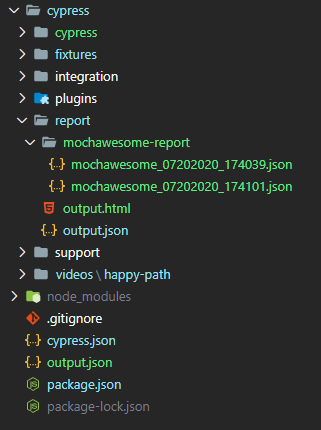
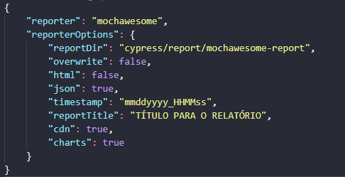
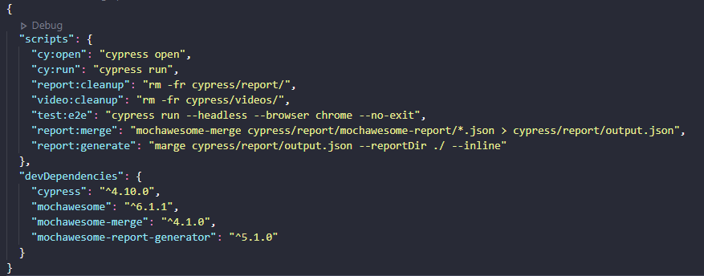

<h2>
  Automatização de testes web: configurando ambiente Cypress + Mochawesome
</h2>

<p>
  O Cypress utiliza linguagem Javascript com algumas bibliotecas para sintaxe de comportamento
  (Mocha, Chai, Sinon).
  <br />
  Você precisará ter o Node instalado na máquina para conseguir rodar as automatizações.
  <br />
  Podemos rodar o Cypress em modo ‘headless’ (sem abrir o navegador visualmente) ou abrindo com o módulo para desktop.
  <br />
  Também é possível gerar relatórios com a instalação de bibliotecas adicionais.
</p>

<h3>Passo a passo inicial:</h3>

<p>
  1. Caso você esteja começando o projeto do zero precisará criar o arquivo ‘package.json’.
  Utilizando npm, abra o terminal na raiz do projeto e digite:

  ```bash
  npm init
  ```
</p>

<p>
  2. Instale o Cypress como dependência de desenvolvimento via terminal:

  ```bash
  npm --save-dev cypress
  ```
</p>

<p>
  3. Você também precisará instalar o Cypress para desktop para usufruir do <i>selector playground</i>
  (vai te ajudar a muito a localizar os elementos!):
  <br />
<h5>Link para download: <a href="https://download.cypress.io/desktop" target="_blank" rel="noopener noreferrer">Cypress
    versão para desktop</a>
</h5>
</p>

<p>
  4. Para rodar o Cypress pela primeira vez e instalar a estrutura de pastas e algumas specs exemplos de teste, você
  pode
  digitar comando no terminal:

  ```bash
  npx cypress open
  ```
</p>

<p>
  5. Para gerar relatórios, utilizo o mochawesome, um dos reporters recomendados pela documentação oficial.
  <br />
  Ao rodar o comando do mochawesome, além de podermos gravar a execução em mp4, serão criados vários JSON (um para cada
  spec de teste). Para uni-los, utilizo o mochawesome-merge, que criará um arquivo 'output.json'.
  <br />
  Para facilitar a visualização, utilizo o mochawesome-report-generator para transformar o 'output.json' em um arquivo
  .html.

  ```bash
  npm install --save-dev mochawesome mochawesome-merge mochawesome-report-generator
  ```
</p>

<h3>
  E depois de rodar esses comandos, a estrutura de pastas será assim:
</h3>

<p>
  
</p>

<h3>
  Ajuste as configurações do Reporter no arquivo 'cypress.json' (na raiz do projeto)
</h3>

<p>
  
</p>

<h3>
  Configure scripts para facilitar os comandos do Reporter no arquivo 'package.json' (na raiz do projeto)
</h3>

<p>
  
</p>

<h3>
  Explicando cada linha do ‘package.json’
</h3>

<p>
  <li>

    ```bash
    "cy:open": "cypress open"
    ```
    Ao comandar ‘npm run cy:open’ no terminal você abre o módulo desktop do Cypress para rodar suas specs de teste.
  </li>
</p>

<p>

  ```bash
  "cy:run": "cypress run"
  ```
  Ao comandar ‘npm run cy:run’ no terminal você roda as specs de teste no formato ‘headless’, sem abrir o módulo desktop
  —
  geralmente utilizando o navegador Electron, gravando as execuções em ‘cypress/videos/…’ .
</p>

<p>

  ```bash
  "report:cleanup": "rm -fr cypress/report/"
  ```
  e

  ```bash
  "video:cleanup": "rm -fr cypress/videos/"
  ```
  Ao comandar ‘npm run report:cleanup’ e ‘npm run video:cleanup’ no terminal você limpa o conteúdo da pasta
  ‘cypress/report/…’ e da ‘cypress/videos/…’ . Normalmente rodo esse comando quando preciso rodar os testes novamente e
  não quero me confundir com os relatórios/vídeos gerados anteriormente.
</p>

<p>

  ```bash
  "test:e2e": "cypress run --headless --browser chrome --no-exit"
  ```
  Ao comandar ‘npm run test:e2e’ no terminal você roda todos os testes no Chrome, sem abrir visualmente o navegador e
  sem
  fechá-lo a cada mudança de arquivo de teste. Gerará os relatórios em .json separado por arquivos de teste, na pasta
  ‘cypress/report/mochawesome-report’
</p>

<p>

  ```bash
  "report:merge": "mochawesome-merge cypress/report/mochawesome-report/*.json > cypress/report/output.json"
  ```
  Ao comandar ‘npm run report:merge’ no terminal você unifica todos os testes .json em ‘cypress/report/output.json’.
</p>

<p>

  ```bash
  "report:generate": "marge cypress/report/output.json --reportDir ./ --inline"
  ```
  Ao comandar ‘npm run report:generate’ no terminal você transforma o output.json em output.html
  (‘cypress/report/output.html’)
</p>