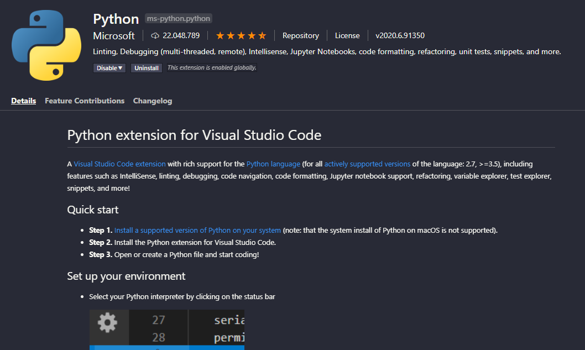
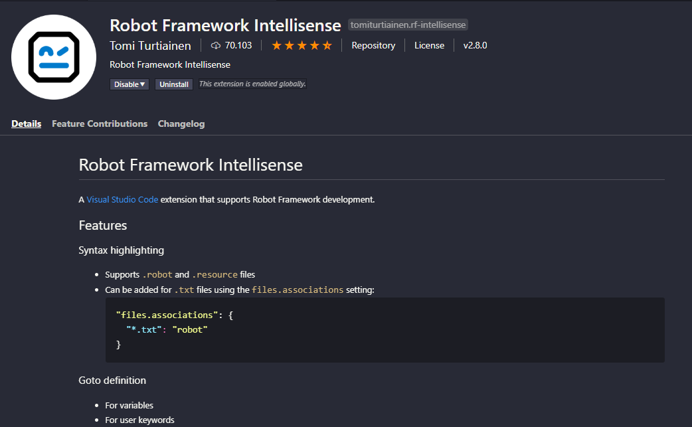

<h2>
  Automatização de testes mobile: configurando ambiente Robot + Appium Library
</h2>

<h3>
  Conhecendo o Robot Framework
</h3>

<p>
  <a href="https://robotframework.org" target="_blank" rel="noopener noreferrer">Clique aqui para acessar a documentação oficial.</a>
  <br />
  O Robot é um framework <i>open source</i> escrito em Python e é utilizado para automação de testes em geral (APIs, web, mobile). Traduz linguagem natural para Python, então não é preciso muito conhecimento técnico de programação para automatizar os testes.
  <br />
  O Robot utiliza bibliotecas e ferramentas adicionais que ajudam a fazer a tradução através de palavras-chave. Utilizaremos a Appium Library para automatizar aplicações mobile 
  <a href="https://serhatbolsu.github.io/robotframework-appiumlibrary/AppiumLibrary.html" target="_blank" rel="noopener noreferrer">Clique aqui para ver a documentação da biblioteca.</a>. 
  <br />
  A Appium Library permitirá que utilizemos palavras-chave como ‘Click Element’, ‘Close Application’, ‘Element Text Should Be’, etc..
  <br />
  Os únicos <i>locators</i> válidos para Appium + Android UIAutomator2 são: 'accessibility id', 'id', 'class name' ou 'xpath' — altamente desencorajado por causa da instabilidade da ‘DOM’.
</p>

<p>
  O Robot Framework roda em Python e precisa ter o Node instalado na máquina para conseguir rodar as automatizações.
  <br />
  Para o setup, é necessário configurar as variáveis de ambiente JAVA_HOME e ANDROID_HOME, bem como a instalação do Appium para Desktop (auxílio na inspeção de elementos)
  <br />
  <a href="https://github.com/clarabez/appium" target="_blank" rel="noopener noreferrer">Clique aqui para acompanhar o manual de configuração da Maria Clara.</a>
</p>

<h3>
  Instalando o Robot Framework
</h3>

<p>
  1. Abra o prompt de comando do Windows e digite o comando:

  ```bash
  pip install robotframework
  ```
</p>

<p>
  2. Instale as extensões específicas do VSCode:
  <br /><br />
  Instale a versão oficial para rodar o Python:
  <p>
    
  </p>
  
  E também a extensão do Robot Framework Intellisense (ele te ajudará em sintaxes próprias dos arquivos de teste '.resource' e '.robot'):
  <p>
    
  </p>
</p>
